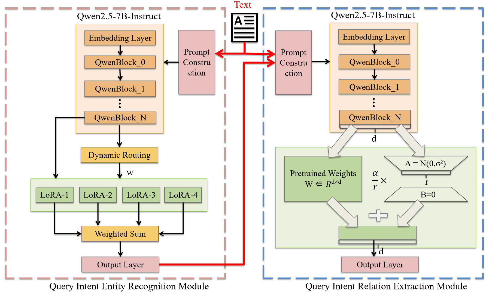

# CDTIR：基于类别感知动态路由与信息传播的游客意图识别

## 描述

CDTIR（**C**ategory-aware **D**ynamic routing and information propagation for **T**ourist **I**ntent **R**ecognition，基于类别感知动态路由与信息传播的旅游意图识别）是一个参数高效的框架，用于从用户旅游规划提问中抽取结构化的意图信息（实体与关系）。它融合了提示工程、大语言模型（LLM）与 LoRA 微调，完成两个子任务：

- **提问意图实体识别**——15 类实体，划分为四大类（地点、时间、服务、属性）。
- **提问关系抽取**——6 类关系（游玩顺序、出行时间、停留时长、预算限制、人均预算、体验内容）。

框架包含两个核心机制：（1）**类别感知动态路由机制**（MoRE，Multi-LoRA with Router-based Entity Recognizer，基于路由的多分支 LoRA 实体识别模型），根据实体类别自适应融合多个 LoRA 分支；（2）**实体感知信息传播策略**，将实体识别结果作为语义先验传递到关系抽取模块。

框架整体结构如下图所示：



## 数据集

语料库由来自三大平台（携程攻略社区问答、马蜂窝问答、小红书）的用户旅游规划提问构成，采用多重角色 LLM 标注策略并结合人工校验。

- **实体**：15 类，分 4 大类——地点（目的地/出发地/返程地）、时间（时间/时长）、服务（餐饮/住宿/产品/交通）、属性（预算/人群/强度/人气/人数/天气）。
- **关系**：6 类——游玩顺序、出行时间、停留时长、预算限制、人均预算、体验内容。
- **规模**：2,726 条记录；train / valid / test = 2,211 / 258 / 257（约 8:1:1）。其中训练集的 2,211 条**已经包含** 150 条预算类增强样本（`aug_budget_*`），因此非增强语料为 2,576 条。

| 划分 | 行数 |
| --- | --- |
| train | 2,211 |
| valid | 258 |
| test | 257 |

> **数据可用性。** 支撑本研究结论的数据可在合理请求下向通讯作者获取。

### 数据目录

所有实验均使用 `data_end/data_merged/` 中的**最终数据集**，它由原始数据集（`data_origin`）加 150 条预算增强样本构建而来：

- `data_origin/` —— 原始数据集（平铺：`entity_all.jsonl`、`relation_all.jsonl`、`relation_all_e.jsonl`；已完成采集与标注，尚未增强/清洗/划分）。
- `data_aug/budget_samples.jsonl` —— 150 条预算增强样本（`aug_budget_*`）。
- `data_merged/` —— 最终数据集：`data_origin` 拼接 150 条增强样本后，清洗并按 8:1:1 划分为 train/valid/test。

构建 `data_merged`（拼接 → 清洗 → 划分）：

```bash
python src/build_data.py               # 复用已提交的划分（test 集固定）
python src/build_data.py --resplit     # 强制重新随机 8:1:1 划分
```

默认复用已提交的 `split_membership.jsonl`（test 集固定，保证论文指标可复现）；加 `--resplit` 则忽略它并重新随机划分。

**增强样本说明。** 150 条 `aug_budget_*` 样本属于预算类*实体*增强：每条在 NER 中带有 `预算` 实体标签，在 RE 中**关系输出为空（`[]`）**（`relation_train.jsonl` 与 `relation_train_e.jsonl` 均如此）。它们以「降权的无关系样本」身份参与 RE 训练——见 `--empty-relation-weight`（入口脚本中为 0.1）。

**生成脚本。** 上述样本由 `scripts/gen_budget_aug.py` 用本地 Qwen2.5-7B 生成（经 `validate()` 校验与去重后写入 `data_aug/budget_samples.jsonl`）；`src/build_data.py` 再将其拼入 `data_merged`，增强样本归入 train 划分。

数据自检：

```bash
python run.py smoke-test --verbose
```

## 代码

```
main/
├── run.py                  # 统一 CLI（train / predict / evaluate / benchmark / paper-*）
├── src/build_data.py      # 由 data_origin 构建 data_merged（拼接 → 清洗 → 划分）
├── src/tourism_ie/         # 核心包
│   ├── training.py         # LoRA / MoRE（router_multilora）训练
│   ├── inference.py        # 预测（基础模型 / adapter / router 包）
│   ├── router_multilora.py # 类别感知动态路由（MoRE）
│   ├── router_grouped.py   # 分组路由（TF-IDF + LogisticRegression）
│   ├── paper.py            # 论文预设、数据审计、NER→RE 流水线、报告（表 9/10、图 4）
│   ├── modeling.py         # 模型 / 分词器加载
│   ├── metrics.py          # 评估（micro/macro/weighted P/R/F1、准确率）
│   ├── prompts.py          # 提示词模板（NER / RE 各 profile）
│   ├── data_utils.py       # 数据路径、提示渲染、实体格式化
│   ├── data_cleaning.py    # NER 清洗 / 纠错（clean-data）
│   ├── data_split.py       # benchmark 划分（split-data）
│   └── models/registry.py  # 基座注册表
├── scripts/                # 自测、清单、数据工具
├── run_backbone.sh         # 多基座对比（默认：qwen2.5-7b、glm4-9b）
├── backbone_compare.sh     # 备选基座对比（qwen2.5-7b、glm4-9b、llama3.1-8b）
├── run_ablation.sh         # 消融实验（CDTIR / NMoRE / F / EH / TO）
├── paper_reproduce.sh      # 端到端论文流程（消融 → 表 10 / 图 4）
├── run_fewshot.sh          # few-shot 基线（6 个基座）
├── run_zeroshot.sh         # zero-shot 基线（6 个基座）
├── convert_baichuan_safetensors.py  # Baichuan2 .bin → safetensors 转换
└── more/                   # 与论文实验无关的辅助脚本/工具
```

## 使用说明

所有命令在 `main/` 目录下执行，产物写入 `outputs/`。

### 加载数据集

合并后的数据集位于 `data_end/data_merged/`，为 JSONL 格式：

- `ner/entity_all.jsonl` —— 实体标注（`text_id`、`input`、`output: [{entity_text, entity_label}]`）。
- `relation/relation_all.jsonl` —— 关系三元组（`output: [{subject, predicate, object}]`）。
- `relation/relation_all_e.jsonl` —— 实体感知关系三元组（多一个 `entities` 字段）。
- `benchmark/*.jsonl` —— train/valid/test 划分。

读取示例：

```python
import json
rows = [json.loads(line) for line in open("data_end/data_merged/ner/entity_all.jsonl", encoding="utf-8")]
```

### 入口脚本

#### 多基座对比

```bash
bash run_backbone.sh                     # 默认：qwen2.5-7b、glm4-9b
MODELS="qwen2.5-7b,glm4-9b,llama3.1-8b" bash run_backbone.sh   # 增加第三个基座
MODELS="qwen2.5-7b" bash run_backbone.sh # 只跑某个基座
```

每个模型的产物在 `outputs/backbone_<model>/`（`ner/`、`re/`、`cdtir/`、`ner_eval/`、`re_eval/`、`re_gold_eval/`）。该对比结果对应论文**表 9**。

`backbone_compare.sh` 是备选入口，通过 `run.py benchmark` 跑同一 NER + RE 矩阵（默认基座 `qwen2.5-7b,glm4-9b,llama3.1-8b`）。

#### 消融实验

```bash
bash run_ablation.sh      # CDTIR + 4 变体，产出表 10
bash paper_reproduce.sh   # 等价端到端流程（另含 paper-data 审计 + 清单）
```

| 变体 | NER | RE |
| --- | --- | --- |
| CDTIR | MoRE（Router-MultiLoRA） | entity-aware LoRA（paper_re_e） |
| CDTIR_NMoRE | 普通 LoRA | 复用 CDTIR |
| CDTIR_F | zero-shot | zero-shot |
| CDTIR_EH | 复用 CDTIR | entity-aware hard（paper_re_eh） |
| CDTIR_TO | 复用 CDTIR | text-only（paper_re_to） |

产物在 `outputs/paper/<variant>/`，消融表在 `outputs/paper/reports/table_10.csv`（论文**表 10**），另有 `figure_4.{png,pdf,csv}`（论文**图 4**）与 `re_e_gold_upper_bound.csv`。

#### few-shot / zero-shot 基线

```bash
bash run_fewshot.sh    # 6 个基座：qwen3-8b、baichuan2-7b、qwen2.5-7b、glm4-9b、llama3.1-8b、mistral7b-v0.3
bash run_zeroshot.sh   # 同样 6 个基座，zero-shot
```

这两个脚本逐个下载基座、跑 NER/RE、保留产物后删除权重以控制磁盘占用。

### 复现论文（最小路径）

1. **安装**环境（`pip install -r requirements.txt`）。
2. **预下载基座模型**——脚本以 `HF_HUB_OFFLINE=1` 运行（见「要求 → 模型」）。
3. **数据审计**：`python run.py paper-data`（校验 `data_end/data_merged`，写入 `data_build_report.json` / `label_distribution.csv`）。
4. **基座对比（表 9）**：`bash run_backbone.sh`。
5. **消融 + 图 4（表 10）**：`bash run_ablation.sh`（或 `bash paper_reproduce.sh`）。
6. **基线**：`bash run_fewshot.sh` 与 `bash run_zeroshot.sh`。

关键超参数（取自 `src/tourism_ie/paper.py` 与入口脚本）：LoRA r=8 / α=32 / dropout=0.1，batch 2 × grad-accum 2，lr 3e-5（cosine，warmup-ratio 0.01），max-grad-norm 1.0，epochs 4，seed **2026**，router-loss-weight 0.5，empty-relation-weight 0.1；NER max-length 512，RE max-length 1200。

产物与论文对应关系：

- `re_e_pred_predictions.jsonl` —— **真实** NER→RE 流水线结果（以预测实体为先验），即论文主报告的关系指标来源。
- `re_e_gold_predictions.jsonl` —— 金标实体上界，单独记录在 `re_e_gold_upper_bound.csv`。
- `outputs/paper/reports/table_9.csv` / `table_10.csv` / `figure_4.*` —— 论文表 9、表 10、图 4。

> **随机种子说明。** **训练**种子为 `2026`（入口脚本、`paper.py`、`MANIFEST.json` 已统一）。**数据集划分**使用另一个固定种子（`42`，见 `src/tourism_ie/data_split.py` 与 `split_membership.jsonl`）；两者互不相关。

> **硬件。** 7–9B 基座以 batch 2 / grad-accum 2 训练；参考实验使用 RTX 5090（24 GB）。建议单卡 24 GB 及以上；若 OOM，训练加 `--gradient-checkpointing`、推理加 `--load-in-4bit`。

### 常用 CLI

```bash
python run.py list-models          # 列出注册模型
python run.py list-strategies      # 列出策略
python run.py paper-data           # 审计论文数据集
python run.py paper-train --help   # 训练论文预设（消融）
python run.py cdtir-predict --help # NER → RE 流水线（Pred + Gold 上界）
python run.py paper-report         # 生成图 4 / 表 9 / 表 10
python run.py train --help         # 通用训练
python run.py predict --help       # 通用预测
python run.py evaluate --task relation \
  --predictions outputs/cdtir_final/re_e_gold_predictions.jsonl \
  --output-dir outputs/re_gold_eval_final
```

通用训练示例（NER MoRE）：

```bash
python run.py train \
  --task ner --split benchmark --data-dir data_end/data_merged \
  --model qwen2.5-7b --strategy router_multilora \
  --prompt-profile paper_ner --max-length 512 --epochs 4 \
  --output-dir outputs/my_ner
```

## 要求

- Python 3.12
- PyTorch 2.5.1+cu124（CUDA 12.4）——CUDA 版本需与 GPU 驱动匹配（见 `requirements.txt` 顶部说明）
- transformers 4.57（requirements.txt 允许 `>=4.48,<5`）、peft、datasets、safetensors、openpyxl

```bash
pip install -r requirements.txt
```

### 模型（HF 离线缓存）

基座模型从本地 Hugging Face 缓存加载（`~/.cache/huggingface/hub`，软链接到数据盘 `/root/autodl-tmp/hf_home/hub`）：

| 注册名 | HF 仓库 | 备注 |
| --- | --- | --- |
| `qwen2.5-7b` | Qwen/Qwen2.5-7B-Instruct | |
| `qwen3-8b` | Qwen/Qwen3-8B | |
| `glm4-9b` | zai-org/glm-4-9b-chat-hf | |
| `llama3.1-8b` | meta-llama/Meta-Llama-3.1-8B-Instruct | gated，需先接受许可 |
| `mistral7b-v0.3` | mistralai/Mistral-7B-Instruct-v0.3 | |
| `baichuan2-7b` | baichuan-inc/Baichuan2-7B-Chat | 仅 `.bin`，需先转 safetensors |

> **离线默认。** 入口脚本会 `export HF_HUB_OFFLINE=1`，即**只**从本地缓存加载模型。首次使用须先下载各基座（LLaMA 需先接受许可）。few-shot/zero-shot 脚本会逐个下载模型后再切回离线模式。

下载（镜像）：

```bash
export HF_ENDPOINT=https://hf-mirror.com
hf download Qwen/Qwen2.5-7B-Instruct
hf download zai-org/glm-4-9b-chat-hf
hf download meta-llama/Meta-Llama-3.1-8B-Instruct   # gated，先 hf auth login
```

> 注意：Baichuan2-7B-Chat 只提供 `pytorch_model.bin`（pickle），torch<2.6 的 `torch.load(weights_only=True)` 会拒绝加载，需先转成 safetensors（见 `convert_baichuan_safetensors.py`）。

> **Windows 用户。** `.sh` 入口脚本需要 Bash——请使用 Git Bash 或 WSL。

## 方法

CDTIR 与基座无关，可在任意受支持的指令微调大模型上实现（见 `src/tourism_ie/models/registry.py` 中的基座注册表）。消融实验采用 **Qwen2.5-7B-Instruct** 作为默认基座。

流程分为两个阶段：

1. **MoRE 实体识别（类别感知动态路由）。** 给定基座 LLM，路由器（两层 FNN + ReLU + Sigmoid）对最后一层隐藏状态的均值池化结果生成四个实体大类的激活权重（地点、时间、服务、属性），再以该权重融合对应 LoRA 分支生成实体识别结果。训练采用联合损失，结合文本生成损失与路由路径选择损失（平衡系数 0.5）。
2. **实体感知关系抽取。** 将实体识别预测结果作为实体先验，连同头尾类型约束传入关系抽取模块，用均衡 LoRA 目标生成关系三元组。

## 引用

如需引用本代码或数据集，请引用：

> 基于类别感知动态路由与信息传播的游客意图识别 (Category-aware Dynamic Routing and Information Propagation for Tourist Intent Recognition)。

## 许可证与贡献

本项目仅用于研究与学术用途；其他用途请联系作者。欢迎贡献；请先提交 issue 或 pull request 进行讨论。

## 故障排查

- **CUDA OOM**：降 `--batch-size`；训练加 `--gradient-checkpointing`；推理加 `--load-in-4bit`。
- **RE-E 缺实体**：entity-aware 用 `relation_*_e.jsonl`（含 `entities`）；EH/TO 才用 `relation_*.jsonl`。
- **模型加载失败**：确认 `HF_HUB_OFFLINE=1` 且模型在 HF 缓存；LLaMA 需先接受许可。
